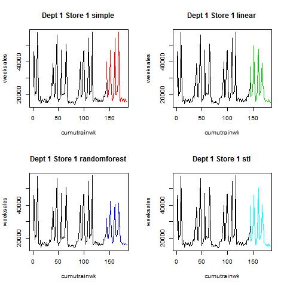
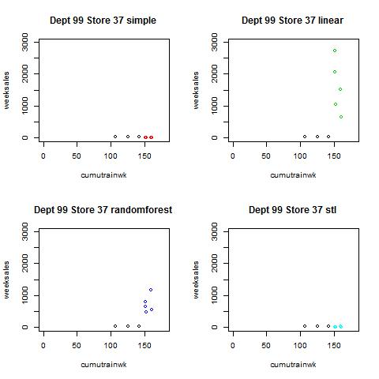

# kaggle_walmart_425proj
This repo includes my code and results for final project of applied regression and design course.
The project was to attend an ended Kaggle competition: Walmart Store Sales Forecasting.
This code can produce a submission that ranks 2/691 on the leaderboard.
# Some of the results

